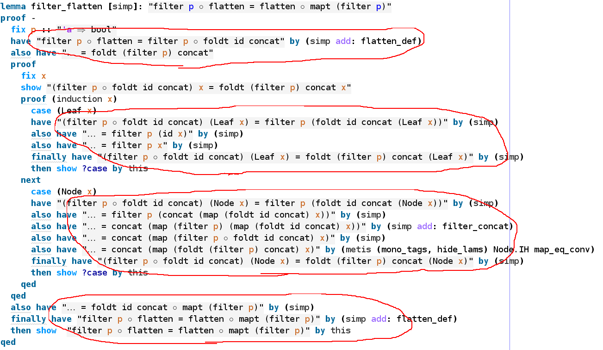
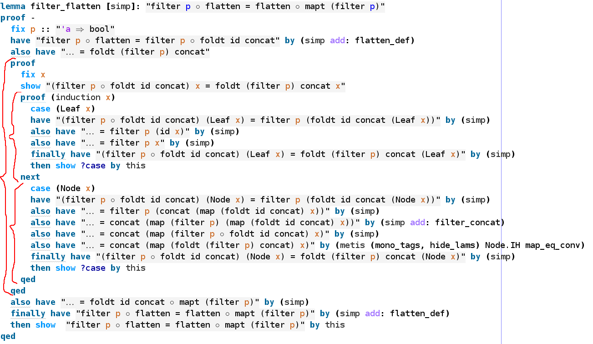
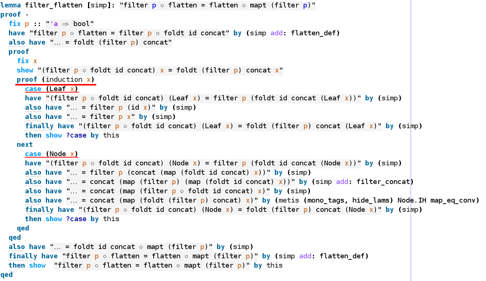
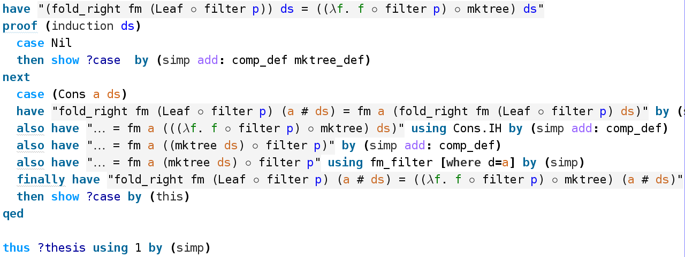

<!-- $theme: gaia -->

# Searching for Correct Transformations

### Alexander Tchitchigin
#### Typeable.io

---

<!-- page_number: true -->

# Background

* Haskell since 2005
* ICFP Contest in Haskell since 2012
* Isabelle since 2014
* IU Software Engineering Lab (Formal Verification) 2014 - 2016

---
<!-- *template: invert -->

# Equational Reasoning

> Equational reasoning is the method of manipulating structures such as formulas and expressions. The basic idea is that equals can be replaced by equals in any context.

---

# Fusion Laws

```haskell
map f . map g = map (f . g)

filter p . filter q = filter (\x -> q x && p x)

filter p . map f = map f . filter (p . f)
```

```haskell
(.)    :: (b -> c) -> (a -> b) -> (a -> c)
map    :: (a -> b) -> [a] -> [b]
filter :: (a -> Bool) -> [a] -> [a]
```

<small>Nils Anders Danielsson, John Hughes, Patrik Jansson, Jeremy Gibbons. _Fast and Loose Reasoning is Morally Correct_</small>

---
<!-- *template: invert -->

# And that's not all

R. Bird, _Pearls of Functional Algorithm Design_. Cambridge: Cambridge University Press, 2010.

### Favorite chapters

* 16 &mdash; The Boyer–Moore algorithm
* 17 &mdash; The Knuth–Morris–Pratt algorithm

---

# Do we need to verify them?

## 

---
<!-- *template: invert -->

# Running Example

### Jeremy Gibbons. _A Pointless Derivation of Radix Sort_ (Functional Pearl)

---

## Definitions

```haskell
data Tree a = Leaf a | Node [Tree a]

mktree
  :: (Bounded b, Enum b, Eq b)
  => [a -> b] -> [a] -> Tree [a]
mktree []     = Leaf
mktree (d:ds) = Node . map (mktree ds) . ptn d

ptn
  :: (Bounded b, Enum b, Eq b)
  => (a -> b) -> [a] -> [[a]]
ptn d xs = [ filter ((m ==) . d) xs) | m <- rng ]

rng :: (Bounded a, Enum a) => [a]
rng = [minBound .. maxBound]
```

---

## More Definitions

```haskell
foldt :: (a -> b) -> ([b] -> b) -> Tree a -> b
foldt f g (Leaf x)  = f x
foldt f g (Node ts) = g (map (foldt f g) ts)

mapt :: (a -> b) -> Tree a -> Tree b
mapt f = foldt (Leaf . f) Node

flatten :: Tree [a] -> [a]
flatten = foldt id concat

treesort
  :: (Bounded b, Enum b, Eq b)
  => [a -> b] -> [a] -> [a]
treesort ds xs = flatten $ mktree ds xs
```

---

## Preparations

```haskell
treesort ds xs = flatten $ mktree ds xs
```

:arrow_down:

```haskell
treesort ds = flatten . mktree ds
```

---

## Preparations

```haskell
treesort ds  = flatten . mktree ds
```

:arrow_down:

```haskell
treesort = (flatten .) . mktree
```

---

# Law of Folding

```haskell
h = foldr f e
```

if and only if

```haskell
h []     = e
h (x:xs) = f x (h xs)
```

---

# Fusion Law for foldr

```haskell
h . foldr f e = foldr f' e'
```

if and only if

```haskell
e'                     = h e
h (f a (foldr f e xs)) = f' a (h (foldr f e xs))
```

---

# Law of Folding Trees

```haskell
h = foldt f g
```

if and only if

```haskell
h . Leaf = f
h . Node = g . map h
```

---

# Fusion Law for foldt

```haskell
h . foldt f g = foldt f' g'
```

if and only if

```haskell
h . f = f'
h . g = g' . map h
```

---

## mktree revisited

```haskell
mktree []     = Leaf
mktree (d:ds) = Node . map (mktree ds) . ptn d
```

thus

```haskell
mktree = foldr fm Leaf
  where fm d g = Node . map g . ptn d
```

---

# And the task is

```haskell
treesort = (flatten .) . mktree
```
find `et`, `ft` such that

```haskell
treesort = foldr ft et 
```

---

# Problems with Liquid Haskell

* Refinement Reflection is great but WIP
* No support for Type Classes
* No support for anonimous functions
* (Were) No standard library of reflected definitions

---

# Problems with F*

* "Type Classes" implemented manually
* No "Proof Combinators" library
* Have to manually handle termination and induction arguments in complex cases

---

# Isabelle for the Rescue

* Proving theorems since 1986
* Good 'ol Math Logic (Higher-Order though)
* Type Classes with axioms
* Reasoning about Sets and Relations
* Structured proofs with Isar
* Function extensionality
* Code extraction
* Sledgehammer! :smile:

---

## What a Proof Looks Like

## 

---

## It Looks Like a Bit Like This

## 

---

## What a Verified Proof Looks Like

## 

---

## Equational Reasoning

## 

---

## Structural Proofs

## 

---

## Structural Induction

## 

---

# Remember the task

Find `et`, `ft` such that

```haskell
treesort = foldr ft et 
```

given that

```haskell
treesort = (flatten .) . fold_right fm Leaf
```

---

## First Step

## 

---

## Intermediate Step

## 

---

### First Part

# 

---

### Second Part

# 

---

## Final Step

```
declare treesort_radixsort[code]

export_code treesort in Haskell
```

---

# And Back to the Code

```haskell
ptn :: forall a. (a -> Arith.Nat) -> [a] -> [[a]];
ptn d xs = map (\ m ->
  filter (\ x -> Arith.equal_nat (d x) m) xs) rng;

ft
  :: forall a. (a -> Arith.Nat)
  -> ([a] -> [a]) -> [a] -> [a];
ft d g = (concat . ptn d) . g;

radixsort :: forall a. [a -> Arith.Nat] -> [a] -> [a];
radixsort = fold_right ft id;

treesort :: forall a. [a -> Arith.Nat] -> [a] -> [a];
treesort = radixsort;
```

---

# Stats

* 33 lines of program code
* 200 lines of proofs (6 times as much)
* About 3-4 days

---

# Issues

* You better know the destination before you start
* Manual rewriting/copy-pasteing

---

# Future Work

* Generalize back to `(Enum b, Bounded b)`
* Even better Haskell output
* More complex algorithms and proofs

---

# My Conclusions

## For pure algorithms it's totally doable but you have to get used to it. So better start practicing now! :smile:

---
<!-- *template: invert -->

# Thanks for Your Attention

## Questions?

---

# Isabelle Listing

### https://gist.github.com/gabriel-fallen/d4f2a79e88f14a9be3e1ec6beeadca1b

---

# References

* [Isabelle](http://isabelle.in.tum.de/)
* [Liquid Haskell](https://ucsd-progsys.github.io/liquidhaskell-blog/)
* [F*](fstar-lang.org)

---

# Liquid / Refinement Types

> Refinement Types = Types + Logical Predicates

```haskell
{-@ fib
  :: {n:Int | n >= 0}
  -> {b:Int | ((b >= n) && (b >= 1))} @-}
fib :: Int -> Int
fib 0 = 1
fib 1 = 1
fib n = fib (n-1) + fib (n-2)
```

---

# Example

```fsharp
let rec strong_map #a1 #a2
  (l: list a1) (f: x:a1{x << l} -> a2) : list a2 =
  match l with
  | [] -> []
  | h :: t -> f h :: strong_map t f
```


